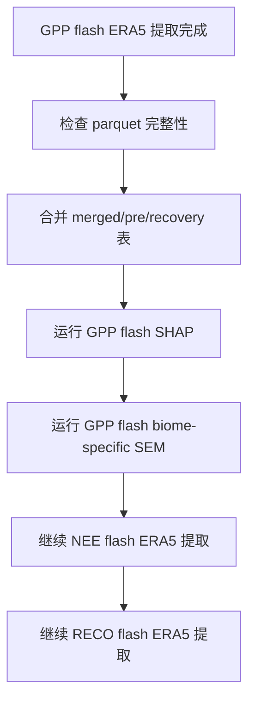

# GLEAM 骤旱 SHAP+SEM 对话工作纪要

更新时间：2026-04-01 20:15 CST

## 📌 目标

本轮工作的核心目标是围绕 GLEAM 事件库，建立只针对 **骤旱（flash）** 的恢复时间解释分析流程，用于后续开展：

- ERA5 环境因子提取
- GLEAM 土壤湿度特征提取
- 干旱事件形态特征提取
- SHAP 特征贡献分析
- biome-specific SEM 机制分析

当前明确暂不优先推进 `nonflash`，先把 `flash` 路线打通。

---

## 🧭 本轮确认的方法口径

### 分析范围

- 事件类型：`flash`
- 土层：
  - `SMrz`
  - `SMs`
- 通量指标：
  - `GPP`
  - `NEE`
  - `RECO`
- 当前优先顺序：
  1. GPP
  2. NEE
  3. RECO

### 建模原则

- 先只做 GLEAM 版本，不混 ERA5 事件库
- SHAP 不做总模型，按 `metric x code_id` 拆成独立模型
- SEM 不做全局一个总模型，优先 biome-specific
- 恢复时间解释以已有响应结果文件中的恢复时间字段为目标变量

---

## 🛠️ 已完成的代码改造

### 1. 文档与计划

已新增：

- [2026-04-01-gleam-flash-shap-sem-design.md](/home/xulc/flash_drought/docs/plans/2026-04-01-gleam-flash-shap-sem-design.md)
- [2026-04-01-gleam-flash-shap-sem-implementation.md](/home/xulc/flash_drought/docs/plans/2026-04-01-gleam-flash-shap-sem-implementation.md)

文档中明确了：

- 只做 flash 的分析口径
- SHAP 与 SEM 的职责拆分
- 预期输出表结构
- 后续运行与验证顺序

### 2. merge / SHAP / SEM 主脚本

已改造脚本：

- [09_merge_feature_tables.py](/home/xulc/flash_drought/process/SEM_analysis/codex/GLEAM/code/09_merge_feature_tables.py)
- [06_shap_analysis.py](/home/xulc/flash_drought/process/SEM_analysis/codex/GLEAM/code/06_shap_analysis.py)
- [07_sem_analysis.py](/home/xulc/flash_drought/process/SEM_analysis/codex/GLEAM/code/07_sem_analysis.py)

主要变化：

- `09` 支持 flash-only 过滤：
  - `--metric`
  - `--code-id`
  - `--biome`
  - `--drought-type`
  - `--soil-layer`
- `09` 支持输出：
  - 完整 merged 表
  - pre-recovery 表
  - recovery-phase 表
- `06` 从 scaffold 改成可运行版本：
  - 支持单组合过滤
  - 自动筛数值特征
  - 删除高缺失和常数字段
  - 使用 `RandomForestRegressor`
  - 在 `shap` 缺失时自动退回 `permutation importance`
- `07` 从 scaffold 改成可运行版本：
  - 读取 SHAP 重要性结果
  - 筛选 top features
  - 过滤单个 biome
  - 构建标准化 SEM 输入表
  - `semopy` 缺失时回退为线性回归摘要

### 3. ERA5 提取脚本重构

已重写：

- [02_extract_era5_features.py](/home/xulc/flash_drought/process/SEM_analysis/codex/GLEAM/code/02_extract_era5_features.py)

原始问题：

- 旧版是逐变量、逐像元、逐事件慢循环
- 小样本都很慢
- 没有稳定的并行能力
- 没有中间分片落盘

新版改造：

- 改为与 [03_extract_gleam_sm_features.py](/home/xulc/flash_drought/process/SEM_analysis/codex/GLEAM/code/03_extract_gleam_sm_features.py) 类似的 tile 并行框架
- 支持参数：
  - `--workers`
  - `--batch-size`
  - `--tile-lat-size`
  - `--tile-lon-size`
  - `--drought-type`
  - `--soil-layer`
- 事件先按空间 tile 切分
- worker 只处理各自 tile
- 中间结果写入 `*_tile_work/features`
- 最终 merge 成 parquet
- 小 tile 数情况下逐 tile 打日志，避免看起来像“卡死”

---

## ✅ 已完成的验证

测试文件：

- [test_sem_analysis_gleam_codex.py](/home/xulc/flash_drought/test/test_sem_analysis_gleam_codex.py)

当前状态：

- 测试数：`22`
- 当前结果：`passed 22 tests`

覆盖了以下核心行为：

- 主表时间字段与 `event_uid` 生成
- 干旱形态特征匹配
- GLEAM 土壤湿度 tile 逻辑
- ERA5 窗口统计逻辑
- 合表分表逻辑
- SHAP 特征筛选逻辑
- SEM 输入构造与标准化逻辑

同时已完成一轮小型 smoke chain：

1. 构造小型 parquet 输入
2. 跑通 `09_merge_feature_tables.py`
3. 跑通 `06_shap_analysis.py`
4. 跑通 `07_sem_analysis.py`

说明 `09 -> 06 -> 07` 这条链路已经可以运行。

---

## 📂 当前已有的关键中间数据

GLEAM 土壤湿度 flash 特征表：

- [gleam_sm_features_flash_smrz.parquet](/home/xulc/flash_drought/process/SEM_analysis/codex/GLEAM/data/gleam_sm_features_flash_smrz.parquet)
- [gleam_sm_features_flash_sms.parquet](/home/xulc/flash_drought/process/SEM_analysis/codex/GLEAM/data/gleam_sm_features_flash_sms.parquet)

GLEAM 非骤旱土壤湿度特征表也已跑完，但当前不作为优先分析对象：

- [gleam_sm_features_nonflash_smrz.parquet](/home/xulc/flash_drought/process/SEM_analysis/codex/GLEAM/data/gleam_sm_features_nonflash_smrz.parquet)
- [gleam_sm_features_nonflash_sms.parquet](/home/xulc/flash_drought/process/SEM_analysis/codex/GLEAM/data/gleam_sm_features_nonflash_sms.parquet)

骤旱事件形态特征表：

- [drought_event_features_flash.parquet](/home/xulc/flash_drought/process/SEM_analysis/codex/GLEAM/data/drought_event_features_flash.parquet)

主表：

- [event_master_table_valid.parquet](/home/xulc/flash_drought/process/SEM_analysis/codex/GLEAM/data/event_master_table_valid.parquet)

---

## 🚀 当前正在运行的任务

目前正在运行两个 GPP 的 flash ERA5 特征提取任务：

1. `GPP code1 / flash / SMrz`
2. `GPP code2 / flash / SMs`

对应日志：

- [02_extract_era5_features_GPP_code1_flash_SMrz_w12_20260401.log](/home/xulc/flash_drought/process/SEM_analysis/codex/GLEAM/results/logs/02_extract_era5_features_GPP_code1_flash_SMrz_w12_20260401.log)
- [02_extract_era5_features_GPP_code2_flash_SMs_w12_20260401.log](/home/xulc/flash_drought/process/SEM_analysis/codex/GLEAM/results/logs/02_extract_era5_features_GPP_code2_flash_SMs_w12_20260401.log)

### 当前运行参数

- 每个任务 `12 workers`
- `batch-size = 200000`
- `tile = 32 x 32`

### 当前预处理完成信息

#### GPP code1 / flash / SMrz

- 匹配事件：`1,322,953`
- 唯一像元：`125,747`
- tile 数：`378`
- 预处理耗时：`17.4 s`

#### GPP code2 / flash / SMs

- 匹配事件：`2,067,785`
- 唯一像元：`136,354`
- tile 数：`383`
- 预处理耗时：`18.3 s`

---

## 📈 当前进度估算

基于 `tile_work/features` 当前已落盘分片数进行粗略估算：

- `code1 / SMrz`：
  - 已完成分片：`11`
  - 总 tile：`378`
  - 粗略完成度：约 `2.9%`

- `code2 / SMs`：
  - 已完成分片：`5`
  - 总 tile：`383`
  - 粗略完成度：约 `1.3%`

### 粗略时间估计

由于刚进入 tile 阶段不久，而且不同 tile 的事件数差异较大，这个估算 **只能作为非常粗的下限级判断**：

- `code1 / SMrz`
  - 粗略剩余时间：约 `6-8` 小时
- `code2 / SMs`
  - 粗略剩余时间：约 `10-14` 小时

> 注意：这是依据“当前已完成 tile 数 / 已运行时间”做的近似线性估算，误差很大。  
> 真正结束时间会受到：
> - tile 内事件密度差异
> - ERA5 读盘速度
> - page cache 命中情况
> - swap 压力
> 的共同影响。

---

## ⚠️ 当前风险与问题

### 1. `getfattr: not found` 日志噪声

这是环境噪声，不是主错误，但会把正常日志淹没，导致看起来像“任务没有进度”。

### 2. swap 压力已经较高

当前资源状态大致为：

- 总内存：`121 GiB`
- 可用内存：仍有几十 GiB 级别
- 但 `swap` 已经接近打满

这说明：

- 任务没有真正爆内存
- 但已经进入较重的内存压力区间
- 不适合继续额外叠加更多 ERA5 提取任务

### 3. ERA5 提取后半段仍然较慢

虽然 `02_extract_era5_features.py` 的前处理已经被明显提速，但 tile 计算阶段仍然是当前整条管线中最重的环节之一。

---

## 🧠 当前执行策略

当前已经确定的策略是：

1. 先只推进 `flash`
2. 先只推进 GLEAM 版本
3. 在不爆内存前提下尽量并行
4. 当前两个 GPP 任务先跑完，不再额外叠加新 ERA5 任务
5. 等任一 GPP 任务完成后，先检查结果完整性，再决定是否继续 NEE / RECO

---

## 🔄 后续计划

后续顺序建议为：

### 下一步最直接动作

- 等待 `GPP code1/code2` 的 ERA5 特征提取完成
- 完成后检查：
  - 行数
  - 列数
  - `event_uid` 重复
  - 缺失率
- 再进入：
  - `09_merge_feature_tables.py`
  - `06_shap_analysis.py`
  - `07_sem_analysis.py`

---

## 📎 备注

本纪要不是逐字转录，而是针对本轮对话内容的结构化整理，重点保留：

- 方法口径
- 脚本改造
- 测试状态
- 运行状态
- 当前风险
- 后续执行路径

如果后续需要，可以继续追加：

- 第二版纪要
- 运行日志追踪纪要
- 单独的 ERA5 性能优化分析文档
