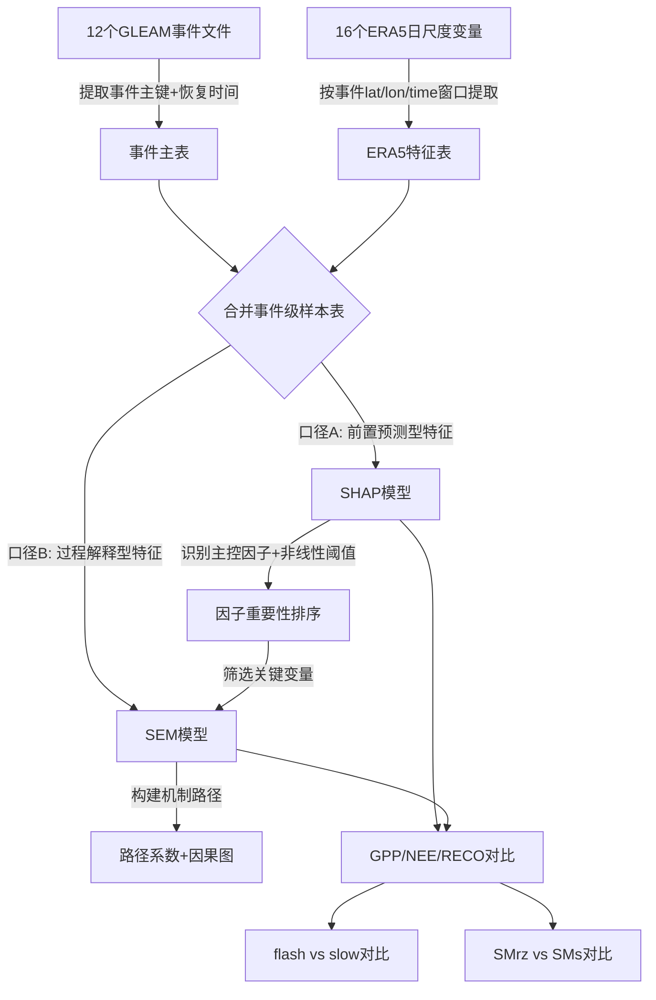
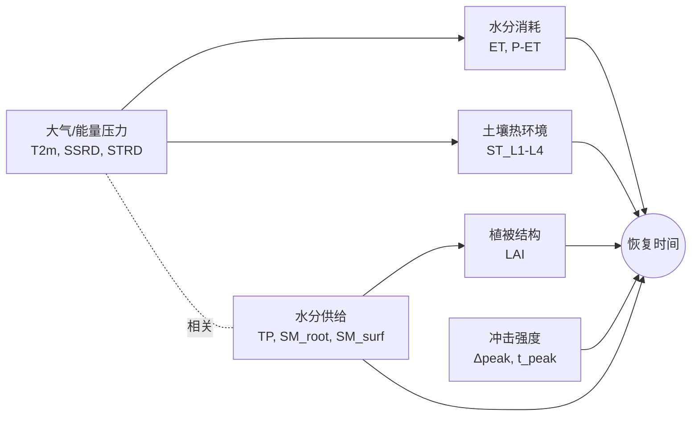

# GLEAM 碳通量恢复时间 SHAP+SEM 驱动机制分析 —— 实施规划

> 更新时间：2026-03-31  
> 路径：`/home/xulc/flash_drought/process/SEM_analysis/`

---

## 1. 研究目标

利用 **SHAP（SHapley Additive exPlanations）+ SEM（结构方程模型）** 联合框架，定量回答：

1. **贡献度问题**：哪些气象/土壤/植被因子对 GPP、NEE、RECO 的闪旱（及慢速干旱）恢复时间贡献最大？
2. **驱动机制问题**：这些因子通过什么路径（直接作用 vs 中介效应）影响恢复时间？
3. **差异比较**：GPP/NEE/RECO 三者的主控因子是否一致？flash vs slow、SMrz vs SMs 的恢复控制机制有何不同？

---

## 2. 数据盘点

### 2.1 目标变量 — 12 个 GLEAM 事件文件

每个 NC 文件为 **事件维度**（event），每一行代表一次干旱事件，核心字段包括 `lat`, `lon`, `onset_year`, `onset_doy`, `t_recover_to_baseline_abs_peak` 等。

| 通量 | 编号 | 干旱类型 | 土壤层 | 事件数（约） | 文件大小 | 路径 |
|------|------|----------|--------|-------------|---------|------|
| GPP | code1 | flash | SMrz | 5.55M | 146M | `GPP-draught-analysis/code1/results/gpp_response_SMrz_events_global_v20260328_latfix_...rec100.nc` |
| GPP | code2 | flash | SMs | — | 213M | `GPP-draught-analysis/code2_SMs/results/gpp_response_SMs_events_global_v20260328_latfix_...rec100.nc` |
| GPP | code3 | nonflash | SMrz | — | 31M | `GPP-draught-analysis/code3_nonflash_SMrz/result/gpp_response_nonflash_SMrz_drought_v20260328_latfix_...rec100.nc` |
| GPP | code4 | nonflash | SMs | — | 7M | `GPP-draught-analysis/code4_nonflash_SMs/result/gpp_response_nonflash_SMs_drought_v20260328_latfix_...rec100.nc` |
| NEE | code1 | flash | SMrz | 5.56M | 172M | `NEE-draught-analysis/code1SMrz/result/nee_response_SMrz_drought_v20260328_latfix_...rec100.nc` |
| NEE | code2 | flash | SMs | — | 252M | `NEE-draught-analysis/code2SMs/result/nee_response_SMs_drought_v20260328_latfix_...rec100.nc` |
| NEE | code3 | nonflash | SMrz | — | 32M | `NEE-draught-analysis/code3_nonflash_SMrz/result/nee_response_nonflash_SMrz_drought_v20260328_latfix_...rec100.nc` |
| NEE | code4 | nonflash | SMs | — | 8M | `NEE-draught-analysis/code4_nonflash_SMs/result/nee_response_nonflash_SMs_drought_v20260328_latfix_...rec100.nc` |
| RECO | code1 | flash | SMrz | 5.55M | 174M | `RECO-draught-analysis/code1/results/reco_response_SMrz_events_global_v20260328_latfix_...rec100.nc` |
| RECO | code2 | flash | SMs | — | 254M | `RECO-draught-analysis/code2_SMs/results/reco_response_SMs_drought_v20260328_latfix_...rec100.nc` |
| RECO | code3 | nonflash | SMrz | — | 33M | `RECO-draught-analysis/code3_nonflash_SMrz/result/reco_response_nonflash_SMrz_drought_v20260328_latfix_...rec100.nc` |
| RECO | code4 | nonflash | SMs | — | 8M | `RECO-draught-analysis/code4_nonflash_SMs/result/reco_response_nonflash_SMs_drought_v20260328_latfix_...rec100.nc` |

> 所有路径前缀: `/home/xulc/flash_drought/process/`  
> 文件名后缀统一: `*_rel0_abspeak_absrec_c30x095_w420_decline30_d5_rec100.nc`

### 2.2 解释变量 — ERA5 日尺度 0.25° 全球数据

路径：`/data/era5_for_GRN/yearly/`，维度：`time(16437) × lat(720) × lon(1440)`，时间跨度 1980–2024。

| 分组 | 变量名 | NC 文件 |
|------|--------|---------|
| **水分供给** | total_precipitation | `total_precipitation_0p25deg_1980_2024.nc` |
| | volumetric_root_soil_water | `volumetric_root_soil_water_0p25deg_1980_2024.nc` |
| | volumetric_soil_water_layer_1 | `volumetric_soil_water_layer_1_0p25deg_1980_2024.nc` |
| **水分消耗** | total_evaporation | `total_evaporation_0p25deg_1980_2024.nc` |
| **能量/热环境** | temperature_2m | `temperature_2m_0p25deg_1980_2024.nc` |
| | ssrd (短波向下辐射) | `ssrd_0p25deg_1980_2024.nc` |
| | strd (长波向下辐射) | `strd_0p25deg_1980_2024.nc` |
| | soil_temperature_level_1–4 | `soil_temperature_level_{1,2,3,4}_0p25deg_1980_2024.nc` |
| **动力/边界层** | wind_u_10m | `wind_u_10m_0p25deg_1980_2024.nc` |
| | wind_v_10m | `wind_v_10m_0p25deg_1980_2024.nc` |
| | surface_pressure | `surface_pressure_0p25deg_1980_2024.nc` |
| **植被结构** | leaf_area_index_high_vegetation | `leaf_area_index_high_vegetation_0p25deg_1980_2024.nc` |
| | leaf_area_index_low_vegetation | `leaf_area_index_low_vegetation_0p25deg_1980_2024.nc` |

### 2.3 事件文件关键字段

基于 `ncdump -h` 验证，每个事件文件包含以下核心变量（以 GPP code1 为例）：

```
坐标与时间: lat, lon, event_id, onset_year, onset_doy, drought_start_year, drought_start_doy
质量控制:   lu_event_valid, overlap_with_prev, overlap_with_next, exclude_from_baseline_recovery
响应检测:   response_detected, t_response_onset_start, t_response_drought_start
峰值信息:   t_peak, t_peak_abs, t_peak_drought_start, t_peak_abs_drought_start
量化指标:   amp_max, gpp_baseline_abs, gpp_baseline_std_abs, gpp_min_abs, gpp_change_to_peak_abs
恢复时间:   t_recover_to_baseline, t_recover_to_baseline_abs_peak ← 主目标
            t_recover_onset_start, t_recover_drought_start, t_recover_post_drought
恢复速率:   recovery_rate_to_baseline
损失量化:   gpp_loss_total_abs, gpp_loss_drought_phase_abs, gpp_loss_post_drought_phase_abs
遗留效应:   legacy_duration, gpp_peak_deficit_abs
```

---

## 3. 核心分析逻辑



> **关键逻辑**: 不是重新识别事件，而是将已有事件视为样本，解释"恢复时间为什么长/短"。

---

## 4. 变量设计

### 4.1 主目标变量

- **`t_recover_to_baseline_abs_peak`** — 从绝对值峰值到恢复基准的天数
- 辅助对照: `t_recover_post_drought`

### 4.2 事件筛选条件

1. `response_detected == 1`
2. `t_recover_to_baseline_abs_peak` 为有限值且 ≥ 0
3. `lat`, `lon`, `onset_year`, `onset_doy` 有效
4. ERA5 窗口缺测率 < 20%

### 4.3 ERA5 特征提取 — 时间窗口设计

> [!WARNING]
> **防信息泄漏**：如果用"恢复后的环境均值"解释恢复时间，窗口长度与目标正相关，会导致伪相关。

**口径 A — 前置预测型**（主 SHAP 用）

仅使用恢复开始前已知信息：

| 窗口 | 定义 | 聚合方式 |
|------|------|---------|
| 干旱前 30 天 | onset_start − 30d ~ onset_start − 1d | mean, std, min, max |
| 爆发阶段 | onset_start ~ drought_start | mean, sum |
| 冲击累积阶段 | drought_start ~ peak | mean, sum, min |

**口径 B — 过程解释型**（SEM 用）

使用恢复过程中的环境条件，但采用**固定窗口**避免泄漏：

| 窗口 | 定义 | 聚合方式 |
|------|------|---------|
| 峰值后 30 天 | peak ~ peak + 30d | mean, sum |
| 峰值后 60 天 | peak ~ peak + 60d | mean, sum |

### 4.4 派生变量

| 派生变量 | 计算方式 |
|----------|---------|
| wind_speed | √(u² + v²) |
| P_minus_ET | total_precipitation − total_evaporation |
| LAI_total | LAI_high + LAI_low |
| soil_temp_gradient | soil_temp_level1 − soil_temp_level4 |

### 4.5 事件形态变量（内生变量）

直接从事件文件提取，作为 SHAP/SEM 的解释变量之一：

- `t_response_onset_start`, `t_response_drought_start`
- `t_peak_abs`, `gpp/nee/reco_change_to_peak_abs`
- `legacy_duration`, `onset_doy`
- `drought_type`（flash/slow × SMrz/SMs 编码）

---

## 5. 分析方法

### 5.1 SHAP 分析

| 项目 | 选择 |
|------|------|
| 模型 | LightGBM / XGBoost |
| 目标 | `t_recover_to_baseline_abs_peak` |
| SHAP 库 | `shap` (TreeExplainer) |
| 特征集 | 口径 A 特征 + 事件形态变量 |

**三层建模策略**:

1. **单文件层**: 12 个模型（每个事件文件独立建模）
2. **通量层**: 3 个模型（GPP/NEE/RECO 分别合并 code1–code4）
3. **综合层**: 1 个模型（全部合并，加入 `metric` + `code_id` 类别变量）

**SHAP 输出**:
- 全局特征重要性条形图
- SHAP beeswarm 图
- 关键变量 dependence plot
- 交互效应图
- 分组对比（flash/slow, SMrz/SMs, GPP/NEE/RECO）

### 5.2 SEM 分析

**角色定位**: SEM 不替代 SHAP，而是将 SHAP 识别的关键因子组织成机制路径。

**假设路径框架**:



**关键科学问题**:
- 水分供给是否通过改善植被状态（LAI）间接缩短恢复时间？
- 高温与辐射是否通过加剧蒸散亏缺延长恢复时间？
- 冲击强度是否直接决定恢复时间，还是通过生理损伤间接影响？

**SEM 特征集**: 口径 B 特征（固定窗口），经 SHAP 筛选后压缩为 5–7 个潜变量组。

---

## 6. 执行阶段

### 阶段 1：数据治理与事件主表构建
- [ ] 脚本 `01_build_event_master_table.py`
  - 统一读取 12 个 GLEAM 目标文件
  - 提取事件主键（lat, lon, year, doy）与所有恢复/响应字段
  - 添加 `metric`（GPP/NEE/RECO）、`code_id`（1-4）、`drought_type`（flash/slow）、`soil_layer`（SMrz/SMs）标签
  - 筛选有效事件（`response_detected==1`, 恢复时间有效）
  - 输出: `gleam_event_master_table.parquet`

### 阶段 2：ERA5 特征提取
- [ ] 脚本 `02_extract_era5_features.py`
  - 按事件 lat/lon 匹配最近 ERA5 网格点
  - 按事件时间 + 窗口定义提取日尺度数据
  - 计算窗口聚合统计量（mean, sum, std, min, max）
  - 计算派生变量（wind_speed, P-ET, LAI_total 等）
  - 分别输出口径 A 和口径 B 特征表

> [!IMPORTANT]  
> ERA5 数据体量巨大（单变量 ~15 GB），需采用 **Dask/分块读取** + **按年并行** 策略，避免内存溢出。

### 阶段 3：探索性数据分析 (EDA)
- [ ] 脚本 `03_eda_and_quality_check.py`
  - 检查变量缺失率、分布、异常值
  - 绘制恢复时间分布（按 metric/code 分组）
  - 相关矩阵 & 共线性检测（VIF）
  - 输出: EDA 报告图表

### 阶段 4：SHAP 分析
- [ ] 脚本 `04_shap_analysis.py`
  - 先从 GPP code1 开始调试模型和 SHAP 流程
  - 扩展到 12 个单文件模型 → 3 个通量模型 → 1 个综合模型
  - 输出: SHAP 全局重要性、beeswarm、dependence、交互图
  - 输出: 分组对比报告

### 阶段 5：SEM 分析
- [ ] 脚本 `05_sem_analysis.py`
  - 基于 SHAP 结果确定进入 SEM 的变量
  - 构建潜变量（水分供给、能量压力、植被结构、冲击强度等）
  - 先在 GPP code1 上验证路径模型
  - 扩展到其他通量和干旱类型
  - 输出: 路径系数表、机制图、拟合优度指标

### 阶段 6：综合对比与报告
- [ ] 脚本 `06_comparison_report.py`
  - GPP vs NEE vs RECO 主控因子对比
  - flash vs slow 机制差异
  - SMrz vs SMs 差异
  - 输出: 综合对比图表与摘要

---

## 7. 技术要点

### 7.1 为什么先 SHAP 后 SEM

| 问题 | 直接上 SEM | 先 SHAP 后 SEM |
|------|-----------|---------------|
| 候选变量多 | 路径不稳定 | SHAP 先筛选 |
| 共线性 | 模型不收敛 | SHAP 不受共线性影响 |
| 非线性关系 | SEM 假设线性 | SHAP 先检测阈值 |
| 变量交互 | 手动假设 | SHAP 自动识别 |

### 7.2 内存管理策略

- ERA5 文件 ~15 GB/变量，16 个变量合计 ~240 GB
- 使用 **Dask lazy loading** + `chunks={'time': 365}`
- 按事件批次提取，不全量加载
- 中间结果缓存为 Parquet

### 7.3 扩展预留

- 本阶段仅使用 GLEAM 版本事件库
- ERA5 版本事件库（`code1_ERA5_root` 等）结构一致，后续可无缝接入
- 代码需预留 `source_type` 参数

---

## 8. 目录结构规划

```
/home/xulc/flash_drought/process/SEM_analysis/
├── implementation_plan.md          ← 本文件
├── gleam_recovery_time_shap_sem_plan_20260331.md  ← 原始详细规划
├── data.md
├── code/
│   ├── 01_build_event_master_table.py
│   ├── 02_extract_era5_features.py
│   ├── 03_eda_and_quality_check.py
│   ├── 04_shap_analysis.py
│   ├── 05_sem_analysis.py
│   └── 06_comparison_report.py
├── data/
│   ├── gleam_event_master_table.parquet
│   ├── feature_table_pre_recovery.parquet
│   └── feature_table_recovery_phase.parquet
├── results/
│   ├── shap/
│   └── sem/
└── plots/
    ├── eda/
    ├── shap/
    └── sem/
```

---

## 9. 验证方案

### 自动化验证
1. **事件主表验证**: 检查 12 个文件的事件数总和是否与原始文件一致
2. **ERA5 特征验证**: 随机抽样 100 个事件，手动核对窗口提取结果
3. **SHAP 一致性**: 对同一模型跑两次 SHAP，验证结果稳定性

### 人工审查
1. **EDA 报告**: 由用户确认恢复时间分布是否合理
2. **SHAP 结果**: 由用户判断主控因子排序是否符合领域知识
3. **SEM 路径**: 由用户确认假设路径是否具有生态学意义
