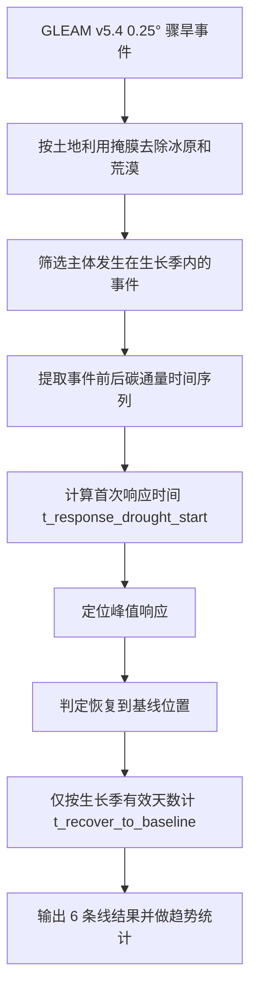

# v20260401 生长季骤旱碳通量分析总结

## 1. 分析目的

本次分析针对 GLEAM 0.25° 去冰原和荒漠后的骤旱事件，评估三类碳通量变量在生长季骤旱下的响应与恢复特征：

- GPP
- RECO
- NEE

分析对象共 6 条线：

- GPP `code1`：SMrz 骤旱
- GPP `code2`：SMs 骤旱
- RECO `code1`：SMrz 骤旱
- RECO `code2`：SMs 骤旱
- NEE `code1`：SMrz 骤旱
- NEE `code2`：SMs 骤旱

对应结果版本统一为 `v20260401_growingseason_recovery_gsdays_rel0_abspeak_absrec_c30x095_w420_decline30_d5_norecmax`。

---

## 2. 数据与版本范围

### 2.1 事件数据

- 根层骤旱事件：`/home/xulc/flash_drought/gleam/clip_result/SMrz_result_v5.4_0p25deg_no_ice_desert/flash_lt20_drought_events_v5.4.nc`
- 表层骤旱事件：`/home/xulc/flash_drought/gleam/clip_result/SMs_result_v5.4_0p25deg_no_ice_desert/flash_lt20_drought_events_v5.4.nc`

这里的骤旱事件来自 GLEAM v5.4 0.25° 结果，且前期已经将 `1-4 天` 与 `5-20 天` 统一归并为 `<20 天骤旱`。

### 2.2 碳通量数据

- GPP：`/data/BESS_V2/BESS_GPP_1982_2022_0.25deg.nc`
- RECO：`/data/BESS_V2/BESS_RECO_1982-2022_0.25deg.nc`
- NEE：`/data/BESS_V2/NEE_1982-2022_0.25deg.nc`

### 2.3 结果目录

- 汇总表：[/home/xulc/flash_drought/process/result_analysis/compare_analysis2/v20260401_growingseason_recovery_gsdays/summary_table_v20260401_growingseason_recovery_gsdays.md](/home/xulc/flash_drought/process/result_analysis/compare_analysis2/v20260401_growingseason_recovery_gsdays/summary_table_v20260401_growingseason_recovery_gsdays.md)
- 年度统计：[/home/xulc/flash_drought/process/result_analysis/compare_analysis2/v20260401_growingseason_recovery_gsdays/annual_response_recovery_trends_v20260401_growingseason_recovery_gsdays.csv](/home/xulc/flash_drought/process/result_analysis/compare_analysis2/v20260401_growingseason_recovery_gsdays/annual_response_recovery_trends_v20260401_growingseason_recovery_gsdays.csv)
- 趋势图目录：`/home/xulc/flash_drought/process/result_analysis/compare_analysis2/v20260401_growingseason_recovery_gsdays`

---

## 3. 生长季骤旱如何判定

### 3.1 事件保留条件

### 3.2 响应与恢复窗口

共享配置 `/home/xulc/flash_drought/process/NEE-draught-analysis/_shared/respon这版并不是重新识别一套全新的骤旱事件，而是在已有 GLEAM 骤旱事件基础上，再叠加生长季约束。

核心判定原则是：

- 事件本身必须是 GLEAM `flash_lt20_drought_events_v5.4` 中的骤旱事件。
- 只有当该事件的干旱持续阶段中，超过一半的天数落在当年生长季内时，该事件才会被保留用于碳通量分析。

也就是说，这里“生长季骤旱”的含义不是要求整个恢复过程都发生在生长季，而是要求**骤旱主体发生在生长季内**。se_configs_v20260322_lu_025deg.py` 中，这一套方法的关键参数包括：

- `start_year = 1982`
- `end_year = 2022`
- `window_before = 60`
- `window_after_from_drought_start = 360`
- `recovery_window = 120`
- `max_window_after = 600`
- `smooth_window = 5`
- `baseline_recovery_consecutive_days = 3`

这些参数表示：

- 每个事件向前取 `60` 天作为前期参考窗口；
- 向后最多搜索到“干旱开始后 `360` 天”，同时总后窗不超过 `600` 天；
- 响应与恢复相关指标基于平滑后的时间序列计算；
- 返回基线的恢复判定要求连续满足至少 `3` 天。

### 3.3 响应判定逻辑

当前版本沿用了 `rel0_abspeak_absrec_c30x095_w420_decline30_d5` 这一条方法主线，再叠加生长季恢复日数统计。

从方法演进上，它的核心思想可以概括为：

- 用事件发生前的窗口建立基线；
- 在干旱开始后的搜索窗内寻找“首次可识别响应”；
- 之后定位影响峰值；
- 再判断何时恢复到基线附近。

在输出结果中，最重要的响应时间字段是：

- `t_response_drought_start`

它表示：

- 从干旱开始到首次检测到有效响应所经过的天数。

### 3.4 恢复判定逻辑

这一版与之前 `rec100` 或普通 `growingseason` 版本最关键的区别，不在于“恢复日期是否改变”，而在于**恢复历时如何计数**。

共享逻辑 `/home/xulc/flash_drought/process/NEE-draught-analysis/_shared/response_standardization_v20260322_lu_025deg.py` 中：

- `recover_idx` 仍然表示时间序列上回到基线附近的位置；
- 但 `t_recover_to_baseline` 在本版本中采用 `growing_season_only` 方式计数；
- 也就是说，从峰值到恢复点之间，只累计位于生长季内的有效天数；
- 休眠季跨越的日历天数不再计入恢复历时。

因此，本版本的恢复时间解释应当是：

- `t_recover_to_baseline` 表示**从峰值恢复到基线所需的生长季有效天数**，而不是简单的日历时间。

---

## 4. 方法流程概括

---

## 5. 六条线结果概览

| 变量 | 情景 | 事件数 | 响应有效% | 响应均值(d) | 响应中位数(d) | 恢复有效% | 恢复均值(d) | 恢复中位数(d) |
| --- | --- | --- | --- | --- | --- | --- | --- | --- |
| GPP | code1 (SMrz) | 2,665,339 | 64.47 | 25.53 | 6.00 | 62.20 | 39.14 | 20.00 |
| GPP | code2 (SMs) | 3,958,937 | 65.46 | 26.17 | 6.00 | 62.93 | 39.15 | 21.00 |
| RECO | code1 (SMrz) | 2,664,747 | 72.10 | 25.65 | 6.00 | 70.39 | 39.48 | 14.00 |
| RECO | code2 (SMs) | 3,958,117 | 73.43 | 24.71 | 6.00 | 71.57 | 38.41 | 14.00 |
| NEE | code1 (SMrz) | 2,665,352 | 56.54 | 28.14 | 5.00 | 54.24 | 38.16 | 18.00 |
| NEE | code2 (SMs) | 3,958,953 | 58.50 | 29.69 | 6.00 | 55.93 | 38.92 | 19.00 |

从总体上看，可以归纳出以下几条稳定特征：

- 三类变量的响应时间中位数都只有 `5-6` 天，说明多数生长季骤旱事件在干旱开始后约一周内就能检测到通量响应。
- 恢复时间明显长于首次响应时间，中位数大致为 `14-21` 天。
- `code1 / SMrz` 与 `code2 / SMs` 的结果结构非常接近，说明从根层到表层的扩展并没有改变整体时序格局。
- RECO 的恢复中位数最短，两个情景都为 `14` 天。
- GPP 的恢复中位数相对最长，为 `20-21` 天。
- NEE 介于两者之间，恢复中位数为 `18-19` 天。

---

## 6. 对生长季版本的理解

### 6.1 为什么要做这个版本

之前使用日历时间计算恢复历时时，如果事件峰值发生在生长季末、而恢复发生在下一次生长季开始后，中间整段休眠期都会被算进恢复时间。这会带来一个问题：

- 看上去恢复变慢了；
- 但其中相当一部分“变慢”只是因为跨越了休眠季，而不是生态系统在活跃生长阶段真的恢复更慢。

因此，`v20260401_growingseason_recovery_gsdays` 的主要目的，就是把“恢复日数”从日历时间改成生长季有效时间。

### 6.2 这一版应该如何解释

这版结果更适合回答的问题是：

- 在生态系统真正活跃的生长季内，骤旱发生后碳通量需要多少有效天数才能恢复。

而不适合直接解释为：

- 从事件峰值到恢复总共跨越了多少自然日。

所以在写论文或结果描述时，建议明确使用下面这种表述：

- “恢复时间表示峰值后回到基线所需的生长季有效天数。”

---

## 7. 年际变化趋势总结

本次已经绘制了三张趋势图：

- [/home/xulc/flash_drought/process/result_analysis/compare_analysis2/v20260401_growingseason_recovery_gsdays/gpp_response_recovery_trend_v20260401_growingseason_recovery_gsdays.png](/home/xulc/flash_drought/process/result_analysis/compare_analysis2/v20260401_growingseason_recovery_gsdays/gpp_response_recovery_trend_v20260401_growingseason_recovery_gsdays.png)
- [/home/xulc/flash_drought/process/result_analysis/compare_analysis2/v20260401_growingseason_recovery_gsdays/reco_response_recovery_trend_v20260401_growingseason_recovery_gsdays.png](/home/xulc/flash_drought/process/result_analysis/compare_analysis2/v20260401_growingseason_recovery_gsdays/reco_response_recovery_trend_v20260401_growingseason_recovery_gsdays.png)
- [/home/xulc/flash_drought/process/result_analysis/compare_analysis2/v20260401_growingseason_recovery_gsdays/nee_response_recovery_trend_v20260401_growingseason_recovery_gsdays.png](/home/xulc/flash_drought/process/result_analysis/compare_analysis2/v20260401_growingseason_recovery_gsdays/nee_response_recovery_trend_v20260401_growingseason_recovery_gsdays.png)

对应的年际统计表为：

- [/home/xulc/flash_drought/process/result_analysis/compare_analysis2/v20260401_growingseason_recovery_gsdays/annual_response_recovery_trends_v20260401_growingseason_recovery_gsdays.csv](/home/xulc/flash_drought/process/result_analysis/compare_analysis2/v20260401_growingseason_recovery_gsdays/annual_response_recovery_trends_v20260401_growingseason_recovery_gsdays.csv)

根据当前汇总结果，年际线性趋势可以概括为：

- 响应时间均值在 6 条线中整体表现为上升。
- GPP 和 NEE 的响应时间增加趋势更明显，约为 `7.9-8.9 天/10年`。
- RECO 的响应时间增加幅度较弱，约为 `4.1 天/10年`。
- 恢复时间趋势整体较弱，多数线仅表现出轻微增加或接近平稳。
- NEE `code1` 的恢复趋势略为负值，说明在只计算生长季有效天数后，其长期恢复变慢信号明显减弱，甚至接近于不再延长。

这与该版本设计目的高度一致：

- 去掉休眠季日历时间后，恢复时间的长期延长趋势被明显削弱；
- 说明此前部分“恢复变慢”更可能是休眠季长度和跨季节结构造成的，而不是生长季内恢复能力本身持续下降。

---

## 8. 建议的结果表述方式

如果后续需要把本版本结果写进论文或总结，建议使用下面这类表述：

1. 本研究在 GLEAM 0.25° 骤旱事件基础上，进一步筛选主体发生于生长季内的事件，用于评估碳通量对生长季骤旱的响应与恢复。
2. 响应时间定义为从干旱开始到首次检测到有效碳通量异常的时间。
3. 恢复时间定义为从峰值异常恢复至基线所需的生长季有效天数，而非简单日历天数。
4. 三类通量的首次响应总体较快，中位数约为 `5-6` 天；恢复则明显更慢，中位数约为 `14-21` 天。
5. RECO 恢复最快，GPP 恢复最慢，NEE 居中。
6. 从长期变化看，响应时间整体延长，但恢复时间的延长趋势在生长季有效日数定义下明显减弱。

---

## 9. 相关文件

- 汇总表：[/home/xulc/flash_drought/process/result_analysis/compare_analysis2/v20260401_growingseason_recovery_gsdays/summary_table_v20260401_growingseason_recovery_gsdays.md](/home/xulc/flash_drought/process/result_analysis/compare_analysis2/v20260401_growingseason_recovery_gsdays/summary_table_v20260401_growingseason_recovery_gsdays.md)
- 汇总 CSV：[/home/xulc/flash_drought/process/result_analysis/compare_analysis2/v20260401_growingseason_recovery_gsdays/summary_table_v20260401_growingseason_recovery_gsdays.csv](/home/xulc/flash_drought/process/result_analysis/compare_analysis2/v20260401_growingseason_recovery_gsdays/summary_table_v20260401_growingseason_recovery_gsdays.csv)
- 年际统计：[/home/xulc/flash_drought/process/result_analysis/compare_analysis2/v20260401_growingseason_recovery_gsdays/annual_response_recovery_trends_v20260401_growingseason_recovery_gsdays.csv](/home/xulc/flash_drought/process/result_analysis/compare_analysis2/v20260401_growingseason_recovery_gsdays/annual_response_recovery_trends_v20260401_growingseason_recovery_gsdays.csv)
- 工作纪要：[/home/xulc/flash_drought/process/SEM_analysis/codex/codex_conversation_summary_20260401.md](/home/xulc/flash_drought/process/SEM_analysis/codex/codex_conversation_summary_20260401.md)
- 共享配置：[/home/xulc/flash_drought/process/NEE-draught-analysis/_shared/response_configs_v20260322_lu_025deg.py](/home/xulc/flash_drought/process/NEE-draught-analysis/_shared/response_configs_v20260322_lu_025deg.py)
- 共享标准化逻辑：[/home/xulc/flash_drought/process/NEE-draught-analysis/_shared/response_standardization_v20260322_lu_025deg.py](/home/xulc/flash_drought/process/NEE-draught-analysis/_shared/response_standardization_v20260322_lu_025deg.py)
